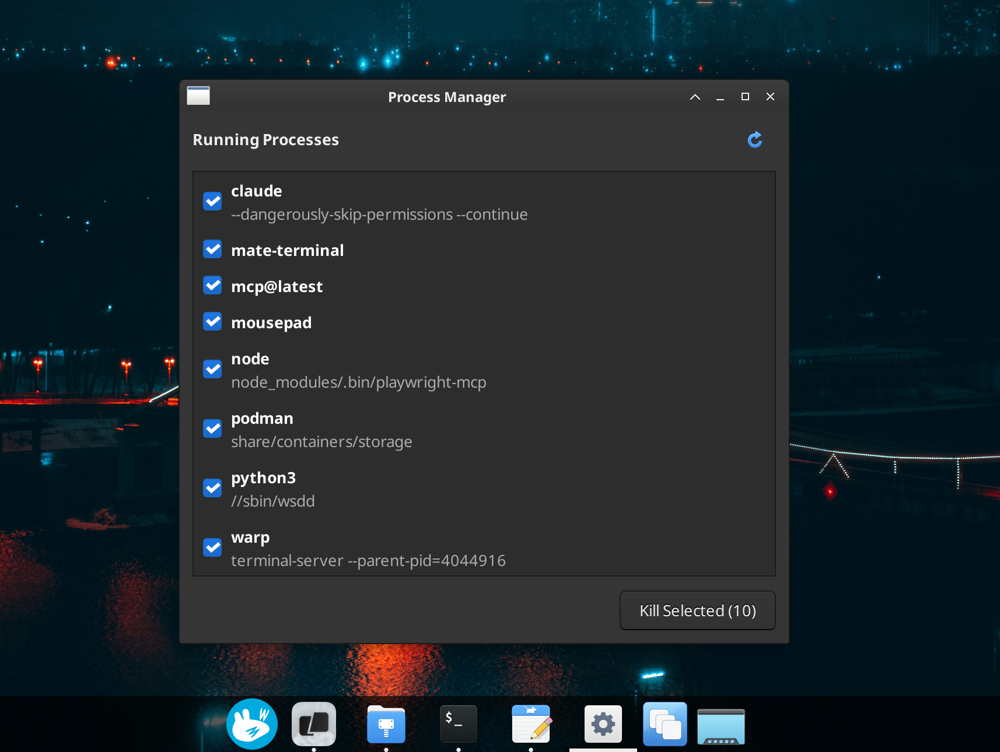

# FastKill

Kill runaway processes hogging CPU and memory without rebooting. Perfect for cleaning up remote desktop VMs after intensive vibecoding sessions.



## Features

- Shows only user processes (filters out system noise)
- Batch select and kill multiple processes at once
- SIGTERM first, SIGKILL on second click for stubborn ones
- Hover for details: PID, command, memory usage, CPU time


No extra dependencies - uses Python 3 and GTK 3, both present out of the box on most Linux desktops.

## Install

```bash
git clone https://github.com/asidko/fastkill.git
cd fastkill
./install.sh            # install

# ./install.sh --remove # uninstall
```

MIT License
